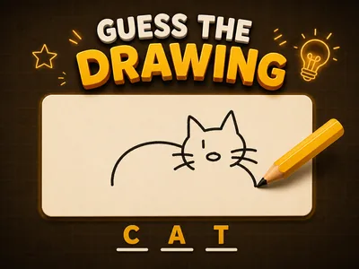
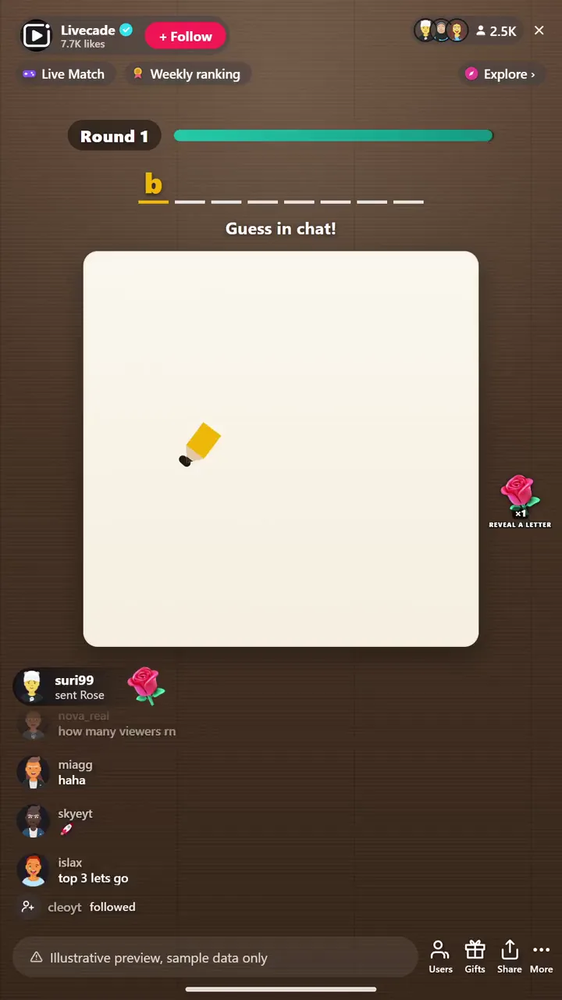

# Guess the Drawing - Interactive TikTok Live Game

> An automatic Pictionary your whole chat races to solve.

An automatic Pictionary. A sketch animates stroke by stroke while viewers race to guess the word in chat. Correct guessers appear live without spoiling the answer, then the word reveals with a fastest-first winners list.

**[Play Guess the Drawing on Livecade](https://livecade.io/games/guess-the-drawing/?utm_source=github&utm_medium=readme&utm_campaign=guess-the-drawing)** - runs as a single browser source in OBS, Streamlabs, or TikTok LIVE Studio. Nothing for viewers to install.

## How viewers play

Viewers take part with the actions TikTok already gives them: **comments**, **gifts**. Every action below is rebindable, so you decide which interaction drives which effect.

| Action | What it does |
| --- | --- |
| **Reveal a letter** | Uncovers a letter of the hidden word to help the room close in |

## How it works

### The sketch draws itself

A drawing animates on screen stroke by stroke. There is nothing to install and no artist needed, the overlay draws the puzzle for you.

### Viewers race to guess

Viewers type the word in chat. Correct guessers appear live without spoiling the answer, and points reward whoever got it fastest and earliest.

### Reveal and rank

When time runs out the word reveals with a fastest-first winners list. A points leaderboard carries across the whole session.

## About the game

Guess the Drawing is a hands-off Pictionary for your whole chat. A sketch draws itself on screen stroke by stroke, and viewers race to type the word in chat.

### Being right does not spoil it for everyone

Correct guessers pop up live without revealing the answer, and points reward whoever got it fastest, with bonuses for guessing early and ranking ahead of the crowd.

### Hints arrive as the clock runs down

Gifts reveal letters to help the room close in, and blanks show the word length with optional progressive hints. When the round ends the word reveals with a ranked, fastest-first winners list, and a points leaderboard carries across the session. The bank holds over 1,900 drawings across more than 300 word categories, in easy, mixed or hard sets, and the reveal can be read aloud.

## What it looks like on stream

[Watch Guess the Drawing gameplay](https://cdn.livecade.io/games/guess-the-drawing.mp4)

## What you can configure

- **Language** - Twelve languages for the word bank and on-screen chrome
- **Difficulty** - Easy, mixed, or hard word banks
- **Drawing time** - How long each sketch has to be guessed
- **Guesses per viewer** - How many wrong guesses each viewer gets per round
- **Word-length blanks and hints** - Show blank slots for the word, reveal the first letter, or drip letters as time runs out
- **Gift reveal cap** - How much of the word gifts are allowed to uncover
- **Scoring** - Base points, a bonus per rank ahead, and an early-guess bonus
- **Leaderboard** - Show a live points board, and how many entries
- **Read the word aloud** - Text-to-speech announcement of the word on reveal
- **Background** - Transparent, a solid color, or your own image

## Languages

English, Spanish, Portuguese, French, German, Italian, Indonesian, Arabic, Turkish, Russian, Hindi, Romanian

## FAQ

<strong>How do viewers play Guess the Drawing?</strong>

Viewers watch a sketch draw itself stroke by stroke and type the word in your TikTok Live chat. Correct guessers appear live without spoiling the answer for the rest of the room.

<strong>Do viewers need to send gifts to play?</strong>

No. Guessing is free and comment-driven. Gifts reveal letters to help the whole room close in faster, which is what drives gifting during a round.

<strong>How does scoring work?</strong>

Points reward whoever guesses fastest, with bonuses for guessing early and for ranking ahead of the crowd. A points leaderboard runs across the whole session.

<strong>How do I add Guess the Drawing to my TikTok Live?</strong>

Add one browser source URL to OBS or your streaming software and go live. There is no plugin to install and nothing for your viewers to download.

## Setup

1. [Create a Livecade account](https://app.livecade.io/register?utm_source=github&utm_medium=cta&utm_campaign=guess-the-drawing)
2. Copy your overlay browser source URL
3. Paste it into OBS, Streamlabs, or TikTok LIVE Studio
4. Pick Guess the Drawing, set your triggers, and go live

Runs in the browser, so it works on Windows and macOS with nothing to download. [See all TikTok Live games](https://livecade.io/tiktok-live-games/?utm_source=github&utm_medium=readme&utm_campaign=guess-the-drawing).

---

_This repository documents Guess the Drawing, a hosted interactive game by [Livecade](https://livecade.io/?utm_source=github&utm_medium=footer&utm_campaign=guess-the-drawing). The game runs on Livecade's platform, so there is no source to install here._
